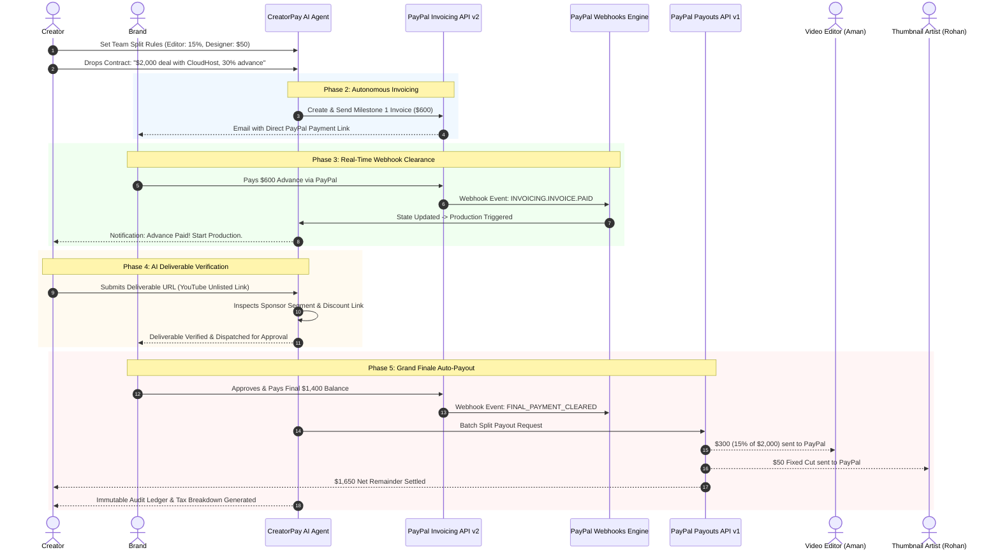

# 🚀 CreatorPay AI
### *Autonomous AI Dealmaker & Settlement Co-Pilot for Creators, SMBs & Agencies*

[](https://developer.paypal.com/)
[](https://devpost.com)
[-black?style=for-the-badge&logo=next.js)](https://nextjs.org/)
[](https://www.typescriptlang.org/)
[](https://tailwindcss.com/)
[](LICENSE)

---

## 📌 Executive Summary

**CreatorPay AI** is an autonomous financial dealmaker and settlement co-pilot engineered for the $250B+ creator and digital merchant economy. 

Solo creators, creative collectives, and digital agencies spend over 30% of their working hours trapped in administrative friction: converting messy contract discussions into invoices, manually tracking bank/card payments, chasing late brand sponsorships, and manually calculating and distributing revenue splits to video editors, thumbnail artists, and collaborators.

**CreatorPay AI solves this end-to-end using the PayPal Developer Platform and AI Agent tool-calling:**
1. **Parses unstructured deal contracts/emails** into milestone payment terms using LLMs.
2. **Autonomously generates and sends PayPal Milestone Invoices** (e.g., 30% advance) via the **PayPal Invoicing API (v2)**.
3. **Monitors payment clearance in real time** via **PayPal Webhooks** (`INVOICING.INVOICE.PAID`).
4. **Verifies deliverable completion** (sponsor links, video segments) via AI multi-modal inspection.
5. **Autonomously disburses instant multi-party revenue splits** to editors and designers via the **PayPal Payouts API (v1)** upon final settlement, generating an immutable audit ledger.

---

## 🎬 Demo & Video Links

* **Live Hosted Application**: *[Coming Soon / Render Deployment]*
* **3-Minute YouTube Video Demo**: *[Coming Soon]*
* **Devpost Submission**: *[Devpost Project Page (Submission #1211120)]*

---

## 🔄 End-to-End Workflow Architecture



---

## 🛠️ PayPal Developer Platform Deep Dive

CreatorPay AI deeply integrates three core primitives of the **PayPal Developer Platform**:

### 1. PayPal Invoicing API (v2)
* **Endpoint**: `/v2/invoicing/invoices`
* **Autonomous Action**: Converts unstructured natural language into structured, compliant milestone invoices.
* **Payload Highlights**: Dynamic invoice numbers, line-item breakdowns (e.g., "Milestone 1: 30% Initial Production Advance"), merchant contact information, currency codes (`USD`), and automated payment reminders.

### 2. PayPal Webhooks Engine
* **Events Handled**:
  * `INVOICING.INVOICE.PAID`: Signals that the brand has settled an invoice milestone, instantly progressing the deal lifecycle state machine.
  * `PAYMENT.PAYOUTSBATCH.SUCCESS`: Confirms that multi-party team splits have cleared into recipient PayPal wallets.
* Eliminates polling bottlenecks and ensures an event-driven, responsive UI.

### 3. PayPal Payouts API (v1)
* **Endpoint**: `/v1/payments/payouts`
* **Autonomous Action**: Executes instant multi-party batch payouts upon contract fulfillment.
* **Payload Highlights**: Client batch header with unique idempotent `sender_batch_id`, individual recipient email receivers, note memos ("CreatorPay Deal Split - Video Editor Cut"), and exact penny-accurate financial split routing.

---

## 💻 Tech Stack & Sponsor Tools

| Component | Technology | Description |
| :--- | :--- | :--- |
| **Framework** | Next.js 14 (App Router) | High-performance React framework for frontend and serverless API endpoints |
| **Language** | TypeScript | Strict type safety for PayPal payloads and financial calculations |
| **Styling** | Tailwind CSS | Modern, responsive dark-mode dashboard tailored for creators |
| **AI / Agent Engine** | Google Gemini API / Function Calling | Natural language contract understanding and deliverable inspection |
| **Payment Gateway** | PayPal Developer REST APIs | Invoicing v2, Payouts v1, Webhook verification in Sandbox |
| **API Testing Tool** | Postman | Validated and mocked PayPal Invoicing & Payouts API endpoints |
| **Deployment** | Render / Vercel | Production cloud deployment for live review |

---

## ⚡ Quickstart & Local Setup

### Prerequisites
* **Node.js** v18+ (tested on v24.x)
* **npm** v9+
* **PayPal Developer Account** with a Sandbox Business app ([developer.paypal.com](https://developer.paypal.com/dashboard/applications/sandbox))

### 1. Clone the Repository
```bash
git clone https://github.com/<your-username>/CreatorPay-AI.git
cd CreatorPay-AI
```

### 2. Install Dependencies
```bash
npm install
```

### 3. Configure Environment Variables
Create a `.env.local` file in the root directory:
```env
# PayPal Developer Sandbox Credentials
PAYPAL_CLIENT_ID=your_sandbox_client_id_here
PAYPAL_CLIENT_SECRET=your_sandbox_client_secret_here
PAYPAL_ENVIRONMENT=sandbox
PAYPAL_WEBHOOK_ID=your_sandbox_webhook_id_here

# AI / LLM Configuration
GEMINI_API_KEY=your_gemini_api_key_here

# App Base URL
NEXT_PUBLIC_APP_URL=http://localhost:3000
```

> 💡 **Demo / Sandbox Simulation Mode**: If you do not have PayPal API keys handy, CreatorPay AI includes a built-in **Interactive Sandbox Simulator** toggle allowing complete evaluation of the agentic workflow and PayPal payload responses!

### 4. Run Development Server
```bash
npm run dev
```

Open [http://localhost:3000](http://localhost:3000) in your browser to interact with the dashboard.

---

## 🧪 Testing Instructions for Hackathon Judges

To evaluate CreatorPay AI's end-to-end agentic workflow:

1. **Phase 0 (Team Rules)**: Navigate to the *Team Split Configuration* tab. Notice default split rules (Video Editor Aman at 15%, Thumbnail Artist Rohan at $50).
2. **Phase 1 (Prompt Drop)**: In the deal command center, select the pre-loaded template:
   > *"Brand CloudHost offers $2,000 for a 60-second video integration. 30% ($600) advance milestone invoice, 70% ($1,400) upon video deliverable. Disburse team cuts automatically."*
3. **Phase 2 (Autonomous Invoice)**: Click **Execute Deal**. Observe the live Agent Execution Log calling `paypal.invoicing.create_and_send`. The generated milestone invoice preview appears with official PayPal sandbox reference IDs.
4. **Phase 3 (Webhook Simulation)**: Click **Simulate Brand Advance Payment ($600)**. Watch the real-time webhook update the deal status to `PRODUCTION_IN_PROGRESS`.
5. **Phase 4 (AI Deliverable Verification)**: Paste the deliverable link and click **Verify Proof**. The AI agent parses the description for sponsor tag `#cloudhost` and sponsorship link confirmation.
6. **Phase 5 (Multi-Party Split Payout)**: Click **Simulate Final Settlement ($1,400)**. Observe the agent calculating exact splits and calling `paypal.payouts.create_batch`. Inspect the resulting **Audit Ledger** showing:
   * **$300.00** -> Video Editor (`aman@editor.com`)
   * **$50.00** -> Thumbnail Designer (`rohan@designer.com`)
   * **$1,650.00** -> Net Creator Balance Settled

---

## 📄 License

This project is licensed under the **MIT License** — see the [LICENSE](LICENSE) file for details.

---

## 👥 Authors & Acknowledgments

* **Ayush Sharma** — Full-Stack & AI Systems Architect
* Built for the **PayPal AI Hackathon 2026** (Track 2: Merchant Solutions).
